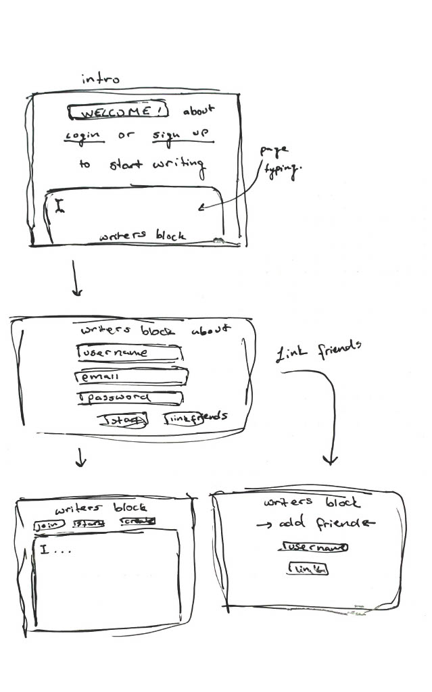
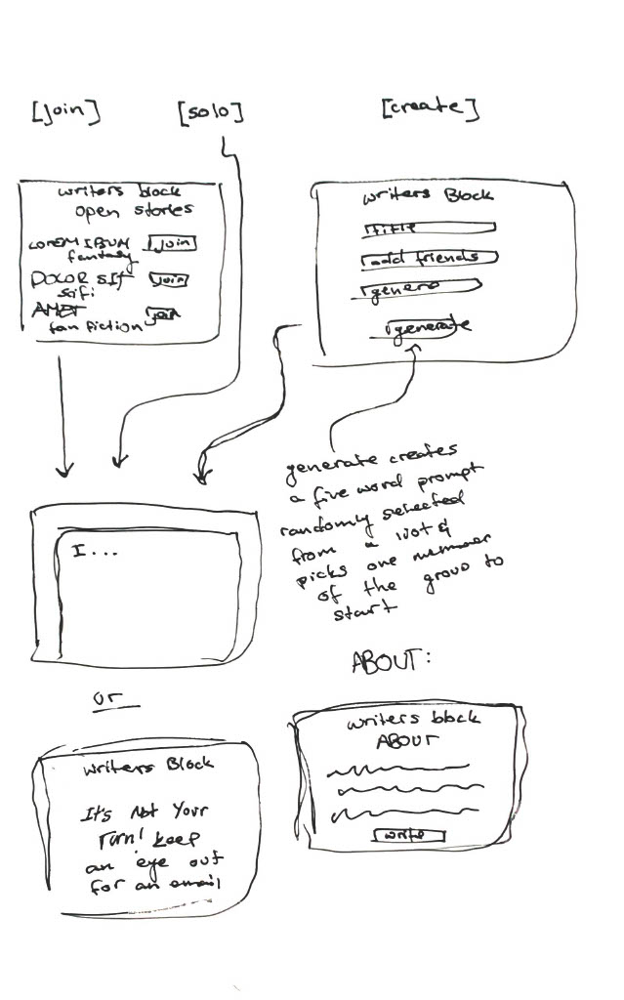

# Elevator Pitch

Have you *ever* felt abandoned by your muse? Like all of a sudden, ***all*** of your inspiration was drained from your head, and bottled, used by some unseen writer simply for amusement? Have you ever wished  you could just pound out *part* of a story, and have the rest finished for you? 

...well.

I may have a solution for you.

In Writer's Block, you can join with a group of friends to co-author a story. Set your word goal, your goal for words per session, and then choose your friends. Then you're set! Writer's Block will generate a set of five random words as your prompt, and then the first author will be randomly selected to write. When they hit their goal, the next person will be notified. They can read the most recent set of writing, and add theirs. And the torch is passed.

Choose your adventure,
choose your story.

### Design

### Key Features

- Secure login and user saving
- Ability to link friends to your account
- Team story production
- Automatic prompt generation
- Fair turn taking
- Board of popular stories

### Technologies

The following technologies will be utilized in my design

- **HTML** - Scaffolds other technologies with correct use of HTML. Also builds separate pages for signup, popular stories, current story, and about page.
- **CSS** - Adds good design and responsive design with slight animations.
- **JavaScript** - Allows for login, user input data, backend calls, and interactive design.
- **Service** - Backend services allow for:
    - Login
    - Text saving
    - Popular story saving
    - Turn taking
    - Saving friends
- **DB/Login** - Stores users, saves text, allows for only registered users to add to stories.
- **WebSocket** - When a user hits their turn count, an email notification is sent to the next person in the chain.
- **React** - Application adjusted to use React. 

### HTML Deliverable

In this deliverable I designed an HTML structure for the following:

- **HTML Pages** - I built ten HTML pages for the basic flow of the webpage, including a profile and writing page, with others such as login and error.
- **Links** - All pages link to other pages though hyperlinked text. Login is initialized on first entry, but is not accessible unless you log out. 
- **Text** - Descriptions for technologies and proper use is outlined through text that is placed throughout the website.
- **Images** - Image placed on the about page as a placeholder for a javascript image library.
- **DB/Login** - Login placed at beginning of website. Placeholders shown throuhout the website for saved names and information from the database such as trending stories.
- **Websocket** - Nudging players is done through notifications sent to profile page. Also updates on stories are sent to both email and notification board on profile.

### CSS Deliverable

In this deliverable I styled the webpage using CSS, and did the following. 

- **Header, Footer, and main content body** -- I used CSS to build a cohesive design throuhgout all elements.
- **Navigation Elements** -- I designed a navigation bar to fit the theme of the website with custom hover colors and wrapped the links in flex divs.
- **Responsiveness** -- This bad boy can handle anything except possibly an apple watch. It looks great and preforms even better due to flexbox and some epic web hooks.
- **Application Elements** -- Elements of the application are properly colored and designed to make UI easy to navigate and easier to look at.
- **Application fonts** -- I took the liberty of employing two of my all time favorite fonts in this website to make typing and writing a pleasurable experience.
- **Application Images** -- Images were scaled and moved to become a part of the overall body, and added a svg logo image that resizes dynamically on otherwise boring pages.

### JavaScript Deliverable 

This deliverable contains these spicy JavaScript components. 
- **login** -- Creating an account saves pertenint information to local storage as a JSON-ified object.
- **database** -- Database is built out of local storage, with user state saved to a user object, and global state to a global object. All stories are assigned and sorted by randomly generated four digit IDs.
- **Websocket** -- Story author counts and user stories react to local changes, later websocket will allow other users to see the same edits.
- **Application Logic** -- Joined stories are ranked using an insertion sort algorithm, and added "🔥🔥🔥" emojis are added to stories with more than twenty authors. All content is saved when a turn is passed, and are displayed on user profile page. On home page there is a main section that shows the progress on the most recent story, and its most recent editor. 

### Service Deliverable

This deliverable contains these groovy endpoint and service components
- **Node.js/Express HTTP service** -- Done! Server now serves up pages using node and Express
- **Static Middleware for Frontend** -- Done! Server does things with pages, you see pages. Everything good.
- **Calls to Third Party Endpoints** -- Prompt generation done through a fetch call to a third party api.
- **Backend Service Endpoints** -- Endpoints created for retrieving story data, updating story content or author count, accessing global list of stories, and adding users to stories.
- **Frontend calls Service Endpoints** -- Tots! Frontend extensively calls backend for continual beautiful updated information from backend endpoints. Everything is run asynchronously through fetch calls to create a flawless user experience.   

### DB / Login Deliverable

This deliverable slides into a database and does some epic things there.
- **MongoDB Atlas database created** -- Completed, with some epic naming conventions
- **Stores data in MongoDB** -- Totally
- **User registration** -- Creates and encrypts user info into database
- **existing user** -- If logging in, opens users account and allows them to work from there (also checks auth token for existing login)
- **Use MongoDB to store credentials** -- Stores both user objects, and all stories in mongodb
- **Restricts functionality** -- Dude, the entire thing fractures if you aren't logged in. This is mainly restricted in the backend.

  ### Websocket Deliverable

  This deliverable black magics up telepathic connections between users.
  - **Backend listens for WebSocket connection** -- Complete, and a bunch of brand new bugs added to allow users to take turns.
  - **Frontend makes WebSocket connection** -- Done! and aformentioned bugs are swept under the carpet.
  - **Data sent over WebSocket connection** -- Completed! Users are sent notifications, and in case they miss them, they're saved to the profile page
  - **WebSocket data displayed** -- Beautiful little alerts will appear on the page in different colors like little disappearing beetles.
 
    ### React Deliverable:

    This deliverable polishes up a tasty website using React for TA's to delight in

    - **Bundled and Transpiled** -- This app was bundled and transplied using Vite and its weird and slightly irritating sorcery.
    - **Components** -- Basically everything is separated into components. For some small examples, the login modal, signup modal, home page joined paper, additions paper, and my stories paper are all separate components (and the list items in the papers are all also separate components)
    - **Router** -- A nested react router handles main requests and then requests to story specific components.
    - **Hooks** -- useState and useEffect are used thoughout the app to give top-notch preformance, as well as several custom-made hooks for api calls and other small tasks thoughout the website. An example of the use of hooks are within the story modal component, which keeps track of the selected story, open paper, and open modal states to deliver a smooth animation. 
